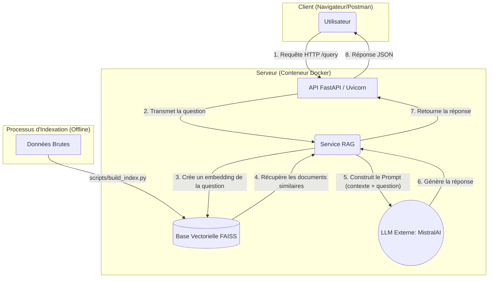
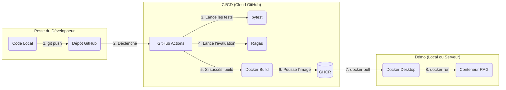

# 🚀 Projet : API RAG pour Événements Publics

Ce projet implémente un système complet de RAG (Retrieval-Augmented Generation) exposé via une API FastAPI. Il est conçu pour répondre à des questions sur des événements publics en utilisant des documents sources.

Le projet est entièrement conteneurisé avec Docker et déployé via un pipeline CI/CD automatisé utilisant GitHub Actions.

```
RAG_SYSTEM_PUBLIC_EVENTS/
├── .github/workflows/          # Dossier pour l'automatisation CI/CD
│   └── ci-cd.yml               # Fichier de workflow GitHub Actions (tests, build, push)
│
├── data/                         # Stockage des données (non versionné avec Git)
│   └── faiss_index/            # Dossier pour la base de données vectorielle
│       ├── index.faiss         # Fichier binaire de l'index FAISS
│       └── index.pkl           # Fichier de mapping des documents (métadonnées)
│
├── src/                          # Le coeur de ton code ("source")
│   ├── api/                    # Module pour l'API FastAPI
│   │   ├── __init__.py         # Indique que 'api' est un package Python
│   │   ├── main.py             # Point d'entrée de l'API (définit les routes /query, etc.)
│   │   └── schemas.py          # Définit les modèles Pydantic (QueryRequest, etc.)
│   │
│   ├── core/                   # Module pour toute la logique RAG
│   │   ├── __init__.py         # Indique que 'core' est un package Python
│   │   ├── data_loader.py      # Fonctions pour charger les données sources
│   │   ├── processing.py       # Fonctions pour nettoyer et "chunker" le texte
│   │   ├── embedding.py        # Gère la connexion au modèle d'embedding (Mistral)
│   │   ├── faiss_manager.py    # Gère la création, sauvegarde et chargement de l'index FAISS
│   │   ├── rag_service.py      # Le service principal qui reçoit une query et retourne une réponse
│   │   └── pipeline.py         # Orchestre la chaîne LangChain (prompt + LLM + retriever)
│   │   └── ... (chatbot.py, query_app.py) # Autres logiques métier
│   │
│   └── Tests/                    # Tes tests unitaires
│       ├── test_api.py           # Teste les points de terminaison de l'API
│       ├── test_data_loader.py   # Teste le chargement des données
│       ├── test_processing.py    # Teste le nettoyage/chunking
│       └── test_embedding.py     # Teste la génération d'embeddings
│
├── Scripts/                      # (Souvent scripts de build ou d'évaluation)
│   ├── build_index.py          # Script pour (re)construire l'index FAISS
│   └── evaluate.py             # Script pour lancer l'évaluation Ragas
│
├── .env                        # Fichier pour les secrets (MISTRAL_API_KEY). Ignoré par Git.
├── .gitignore                  # Fichier listant les dossiers/fichiers à ignorer par Git (.env, .venv, etc.)
├── .python-version             # (Optionnel) Définit la version Python du projet (ex: 3.12)
├── Dockerfile                  # "Recette" pour construire ton image Docker
└── pyproject.toml              # Fichier central ! Définit les dépendances, le nom du projet, etc.

```

## 1. Architecture du Système (Runtime)

Ce schéma montre comment l'API fonctionne une fois qu'elle est lancée dans un conteneur Docker.



### Rôle des Composants (Runtime)

  * **API (FastAPI / Uvicorn)**
      * **Rôle :** C'est la porte d'entrée de l'application. Elle reçoit les requêtes HTTP (comme `/query`) de l'utilisateur, valide les données d'entrée (grâce à Pydantic/Schemas) et les transmet au service RAG. Elle est servie par `Uvicorn`, un serveur web ASGI rapide.
  * **Service RAG (Cœur de l'application)**
      * **Rôle :** C'est le cerveau de l'opération. Il orchestre l'ensemble du processus RAG (à l'aide de **LangChain**). Il prend la question de l'utilisateur, la transforme en vecteur, interroge la base **FAISS** pour trouver des documents pertinents, et enfin, construit un prompt complexe qu'il envoie à **MistralAI**.
  * **Base Vectorielle (FAISS)**
      * **Rôle :** C'est la mémoire à long terme du système. Elle stocke les "embeddings" (représentations vectorielles) des documents sources. Son travail est de trouver *très* rapidement les morceaux de texte les plus pertinents pour une question donnée.
  * **LLM Externe (MistralAI)**
      * **Rôle :** C'est le générateur de texte. Il reçoit le prompt (contenant la question de l'utilisateur et le contexte trouvé par FAISS) et génère une réponse en langage naturel. Il nécessite une clé API (`MISTRAL_API_KEY`) pour fonctionner.

---

## 2. Architecture CI/CD (Déploiement)

Ce schéma montre comment le code est testé, construit et déployé automatiquement à chaque modification.



### Rôle des Composants (CI/CD)

  * **Dépôt GitHub**
      * **Rôle :** Stocke l'intégralité du code source, y compris le `Dockerfile`, le `pyproject.toml` et les workflows d'Actions.
  * **GitHub Actions (`.github/workflows/ci-cd.yml`)**
      * **Rôle :** C'est l'orchestrateur de l'automatisation. Il réagit à un `git push` et exécute une série d'étapes définies :
        1.  **Tester (pytest) :** Lance les tests unitaires pour s'assurer que les fonctions de base du code sont correctes.
        2.  **Évaluer (Ragas) :** Lance le script d'évaluation (`scripts/evaluate.py`) pour mesurer la qualité des réponses du RAG. C'est une étape cruciale de "CI pour IA".
        3.  **Construire (Docker Build) :** Si les tests et l'évaluation réussissent, il utilise le `Dockerfile` pour empaqueter l'application dans une image Docker.
  * **GitHub Container Registry (GHCR)**
      * **Rôle :** C'est un service de stockage d'images Docker. L'image validée par le pipeline y est "poussée" (publiée) et versionnée (avec le tag `latest`).
  * **Docker Desktop (Serveur de Démo)**
      * **Rôle :** C'est l'environnement d'exécution. Il `pull` (télécharge) l'image depuis GHCR et la `run` (lance) en tant que conteneur, en lui injectant les clés API via le fichier `.env`.

---

## 3. Composants Clés du Dépôt

  * `src/api/main.py`
      * **Rôle :** Définit les points de terminaison (routes) de l'API FastAPI, comme `/query` et `/rebuild`.
  * `src/api/schemas.py`
      * **Rôle :** Définit les modèles de données Pydantic pour la validation des requêtes et des réponses.
  * `scripts/build_index.py`
      * **Rôle :** Script manuel ou automatisé pour lire les données brutes, les traiter, calculer leurs embeddings et construire la base de données vectorielle FAISS.
  * `scripts/evaluate.py`
      * **Rôle :** Script utilisé par le pipeline CI/CD pour évaluer la pertinence et la fidélité des réponses du RAG avec la bibliothèque `ragas`.
  * `Dockerfile`
      * **Rôle :** La "recette" pour construire l'image Docker. Il indique quelle version de Python utiliser, comment installer les dépendances (via `uv` et `pyproject.toml`) et quelle commande lancer au démarrage (`uvicorn`).
  * `pyproject.toml`
      * **Rôle :** Fichier central de configuration du projet Python. Il liste toutes les dépendances (comme `fastapi`, `uvicorn`, `langchain`, `faiss-cpu`, etc.).

<!-- end list -->

## 4. Guide d'installation et d'exécution

Il existe deux méthodes pour lancer ce projet : en utilisant l'image Docker pré-construite (recommandé pour la production/démo) ou en l'exécutant localement (pour le développement).

### Méthode 1 : Lancer avec Docker (Recommandé)

Cette méthode utilise l'image Docker déjà testée et publiée sur le GitHub Container Registry (GHCR).

**Prérequis :**
* **Docker Desktop** (pour Windows/Mac) ou **Docker Engine** (pour Linux) doit être installé.

**Étapes :**

1.  **Créer un Personal Access Token (PAT) :**
    * Pour vous connecter à GHCR, vous avez besoin d'un [PAT GitHub (classic)](https://docs.github.com/en/authentication/keeping-your-account-and-data-secure/managing-your-personal-access-tokens#creating-a-personal-access-token-classic) avec **uniquement** la permission `read:packages`. Copiez ce token (ex: `ghp_...`).

2.  **Se connecter à GHCR :**
    * Ouvrez un terminal et connectez-vous. Remplacez `VOTRE_NOM_UTILISATEUR` par le vôtre. Il vous demandera votre mot de passe : collez votre **PAT**.
    ```bash
    docker login ghcr.io -u VOTRE_NOM_UTILISATEUR
    ```

3.  **Créer le fichier `.env` :**
    * Créez un fichier nommé `.env` dans un dossier de votre choix. Il doit contenir votre clé API :
    ```ini
    MISTRAL_API_KEY=votre_cle_mistral_commencant_par_...
    ```

4.  **Télécharger l'image :**
    * Téléchargez la dernière version de l'image (remplacez `ai-christopher/rag-system-public-events` par le nom de votre dépôt si différent).
    ```bash
    docker pull ghcr.io/ai-christopher/rag-system-public-events:latest
    ```

5.  **Lancer le conteneur :**
    * Depuis le dossier contenant votre fichier `.env`, lancez cette commande.
    ```bash
    docker run -d -p 8000:8000 --env-file .env ghcr.io/ai-christopher/rag-system-public-events:latest
    ```

6.  **Vérifier :**
    * Votre API est maintenant accessible à l'adresse `http://localhost:8000`. Vous pouvez aussi voir le conteneur avec une pastille verte "Running" dans Docker Desktop.

### Méthode 2 : Lancer localement (Pour le développement)

Cette méthode vous permet de lancer l'API directement sur votre machine pour tester des modifications rapidement.

**Prérequis :**
* **Python 3.12+**
* **`uv`** (ou `pip`)

**Étapes :**

1.  **Cloner le dépôt :**
    ```bash
    git clone https://github.com/ai-christopher/rag-system-public-events.git
    cd rag-system-public-events
    ```

2.  **Créer un environnement virtuel :**
    ```bash
    python -m venv .venv
    source .venv/bin/activate  # Sur Windows: .\.venv\Scripts\activate
    ```

3.  **Installer les dépendances :**
    * Nous utilisons `uv` pour une installation rapide.
    ```bash
    pip install uv
    uv pip install -e .  # Le '-e' l'installe en mode "éditable"
    ```

4.  **Créer le fichier `.env` :**
    * Créez un fichier `.env` à la racine du projet avec votre clé :
    ```ini
    MISTRAL_API_KEY=votre_cle_mistral_commencant_par_...
    ```

5.  **Lancer le serveur de développement :**
    * `uvicorn` démarrera l'API avec le rechargement automatique (`--reload`).
    ```bash
    uvicorn src.api.main:app --host 127.0.0.1 --port 8000 --reload
    ```

6.  **Vérifier :**
    * Votre API est accessible à l'adresse `http://localhost:8000`.

---

## 5. Exemples d'utilisation de l'API

Une fois l'API lancée (avec Docker ou localement), vous pouvez interagir avec elle.

### Documentation interactive (Recommandé)

Le moyen le plus simple d'explorer l'API est d'utiliser la documentation intégrée (grâce à FastAPI/Swagger) :

* **Documentation Swagger :** `http://localhost:8000/docs`

Depuis l'interface Swagger, vous pouvez voir tous les points de terminaison, leurs descriptions, et même les essayer directement depuis votre navigateur.

### Exemples avec `curl` (Terminal)

Vous pouvez utiliser `curl` depuis votre terminal pour interroger l'API.

#### Interroger le RAG

* **Endpoint :** `POST /ask`
* **Description :** Pose une question au système RAG.
* **Commande :**

```bash
curl -X 'POST' \
  'http://localhost:8000/ask' \
  -H 'accept: application/json' \
  -H 'Content-Type: application/json' \
  -d '{
  "question": "Quelle est la date du prochain événement ?"
}'
````

  * **Réponse attendue (Exemple) :**

<!-- end list -->

```json
{
  "response": "Le prochain événement aura lieu le 15 décembre.",
  "source_documents": [
    {
      "page_content": "La conférence annuelle est prévue pour le 15 décembre...",
      "metadata": { "source": "doc1.pdf" }
    }
  ]
}
```

#### Reconstruire l'index (si implémenté)

  * **Endpoint :** `POST /rebuild`
  * **Description :** Déclenche le script de reconstruction de l'index en arrière-plan.
  * **Commande :**

<!-- end list -->

```bash
curl -X 'POST' \
  'http://localhost:8000/rebuild' \
  -H 'accept: application/json' \
  -d ''
```

  * **Réponse attendue (Exemple) :**

<!-- end list -->

```json
{
  "status": "success",
  "message": "Index reconstruit avec succès à partir de 50 documents."
}
```

### Exemple avec Python (`requests`)

Vous pouvez aussi appeler l'API depuis un autre script Python.

```python
import requests

# L'URL de votre API locale
api_url = "http://localhost:8000/query"

# La question à poser
payload = {
    "query": "Quels sont les thèmes principaux de la conférence ?"
}

try:
    response = requests.post(api_url, json=payload)
    response.raise_for_status()  # Lève une exception si erreur HTTP

    # Afficher la réponse
    data = response.json()
    print("Réponse de l'API :")
    print(data.get("response"))

except requests.exceptions.RequestException as e:
    print(f"Erreur lors de l'appel à l'API : {e}")

```

---

## 6. Choix Techniques, Limites et Améliorations

Cette section justifie les décisions d'architecture prises pour ce projet et identifie les pistes d'amélioration.

### Justification des Choix

* **Architecture (FastAPI + Docker + CI/CD)**
    * **FastAPI** a été choisi pour ses hautes performances, sa documentation automatique (Swagger/ReDoc) et son utilisation moderne de la validation de données avec Pydantic.
    * **Docker** a été utilisé pour encapsuler l'application. Cela garantit une portabilité totale : l'API s'exécutera de la même manière sur le PC d'un développeur, dans un pipeline CI/CD, ou sur un serveur de production.
    * **GitHub Actions (CI/CD)** a été implémenté pour automatiser la validation (tests, évaluation) et la livraison (build/push Docker), réduisant les erreurs humaines et garantissant que seule une version stable du code est publiée.

* **Composants RAG**
    * **Modèle (MistralAI)** : Les modèles Mistral offrent un équilibre de premier plan entre performance (qualité des réponses) et efficacité (vitesse, coût). Leur forte compétence en français était un atout pour ce projet.
    * **Base Vectorielle (FAISS)** : FAISS (développé par Meta) est une bibliothèque extrêmement rapide et efficace pour la recherche de similarité sur de grands ensembles de vecteurs. Son intégration "in-memory" (fichiers `index.faiss` et `index.pkl`) la rend parfaite pour un déploiement simple et rapide sans dépendre d'une base de données externe.
    * **Évaluation (Ragas)** : Utiliser `pytest` seul ne suffit pas pour un projet d'IA. `Ragas` a été choisi car c'est le standard de l'industrie pour l'évaluation des pipelines RAG. Il nous permet de mesurer objectivement des métriques cruciales comme la **fidélité** (l'API n'invente-t-elle rien ?) et la **pertinence** (la réponse est-elle utile ?).

### Limites Actuelles

1.  **Mise à jour des données :** La base FAISS est statique. Si de nouveaux événements sont ajoutés aux sources de données, l'API ne les connaîtra pas tant que l'index n'est pas manuellement reconstruit (`scripts/build_index.py`).
2.  **Scalabilité de l'index :** FAISS s'exécute en mémoire. Si la quantité de documents sources devait augmenter massivement (milliards de documents), cette architecture atteindrait ses limites de RAM.
3.  **Absence de mémoire de conversation :** L'API traite chaque question de manière indépendante. Elle ne peut pas gérer les questions de suivi (par exemple, "Et où se situe-t-il ?" en référence à la réponse précédente).

### Améliorations Possibles

* **Automatiser le Re-indexing :** Ajouter un point de terminaison d'API sécurisé (`/rebuild_index`) qui peut être appelé par un service externe (ex: un cron job) pour reconstruire l'index chaque nuit.
* **Base de Données Vectorielle Managée :** Pour une scalabilité supérieure, migrer de FAISS vers une solution de base de données vectorielle hébergée (ex: Pinecone, Weaviate, Zilliz).
* **Implémenter l'historique de chat :** Modifier l'API pour qu'elle accepte un `session_id` afin de gérer l'historique de la conversation et permettre des interactions plus naturelles.

---

## 7. Validation et Résultats des Tests

Le projet est validé par deux niveaux de tests : des tests unitaires (`pytest`) pour la logique du code et une évaluation de performance (`Ragas`) pour la qualité de l'IA.

### Tests Unitaires (Pytest)

Le pipeline CI/CD exécute la suite de tests unitaires sur chaque `push`. Ces tests couvrent les modules critiques de l'application :

* `Tests/test_api.py` (3 tests)
* `Tests/test_data_loader.py` (4 tests)
* `Tests/test_embedding.py` (4 tests)
* `Tests/test_processing.py` (3 tests)

**Résultat :**
```

============================= 14 passed in 346.73s (0:05:46) =============================

```
*Tous les 14 tests unitaires passent avec succès, garantissant que les composants de base (API, chargement de données, traitement) fonctionnent comme attendu.*

### Évaluation de la Qualité RAG (Ragas)

Nous évaluons la qualité des réponses du RAG sur un jeu de données de test (`evaluate.py`). Les seuils de validation stricts sont activés dans le pipeline CI.

**Résumé des métriques (sur le jeu de test) :**

| Métrique | Score Obtenu | Seuil Requis (CI) | Description |
| :--- | :---: | :---: | :--- |
| **Faithfulness (Fidélité)** | **1.00** / 1.00 | 0.8 | La réponse est-elle factuellement basée sur le contexte ? (Pas d'hallucination) |
| **Answer Relevancy** | **0.88** / 1.00 | - | La réponse est-elle pertinente par rapport à la question ? |
| **Context Precision** | **0.875** / 1.00 | 0.5 | Les contextes récupérés sont-ils tous pertinents ? |
| **Context Recall** | **1.00** / 1.00 | - | Tous les contextes nécessaires ont-ils été récupérés ? |

**Analyse des résultats :**

* **Scores Parfaits (1.0) :** Les scores de `faithfulness` et `context_recall` sont parfaits. Cela signifie que l'API **n'invente aucune information** et qu'elle **récupère systématiquement le bon document** pour répondre.
* **Scores Élevés (0.88 - 0.875) :** Les scores de pertinence sont excellents et bien au-dessus des seuils.
* **Cas d'analyse (ID 3) :** Le seul cas où la `context_precision` a baissé (0.5) est la question sur "Noël à Montpellier". L'API a récupéré un document sur une "Soirée jeux", qui n'était pas pertinent. Cependant, la `faithfulness` de 1.0 montre que le modèle a géré cette situation en déclarant qu'il n'avait pas d'information, ce qui est le comportement attendu (il n'a pas "halluciné" un événement de Noël).

**Conclusion :** Le pipeline RAG démontre une très haute qualité, avec une fiabilité (fidélité) parfaite et une excellente pertinence, validant ainsi l'architecture technique choisie.